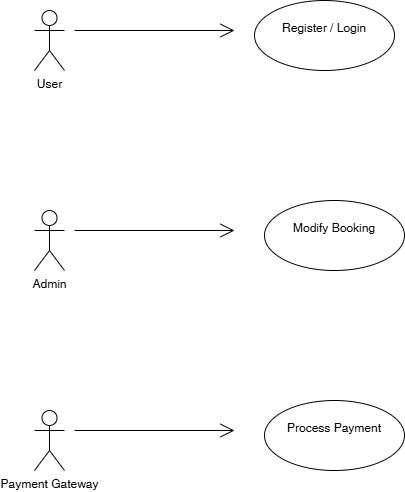

# Requirement Analysis in Software Development

This repository is dedicated to exploring the concept of Requirement Analysis within the Software Development Life Cycle (SDLC). It covers key activities such as gathering, analyzing, documenting, and validating software requirements to ensure that the final product meets stakeholder expectations.

The purpose of this repository is to provide clear insights and resources related to requirement analysis, helping developers and project teams understand and implement this crucial phase effectively.

---

## What is Requirement Analysis?

Requirement Analysis is the process of systematically gathering, examining, and defining the needs and expectations of stakeholders for a software project. It serves as a foundational phase in the Software Development Life Cycle (SDLC) that helps ensure the software developed aligns with business goals and user requirements.

During Requirement Analysis, the development team works closely with stakeholders to collect detailed requirements, clarify any ambiguities, and document these requirements clearly. This phase helps identify functional and non-functional requirements, assess feasibility, and set the scope for the project.

The importance of Requirement Analysis lies in its ability to minimize misunderstandings, reduce project risks, and prevent costly changes later in the development process. By thoroughly analyzing requirements upfront, teams can deliver software that meets user needs, on time and within budget.
## Why is Requirement Analysis Important?

Requirement Analysis is a critical phase in the Software Development Life Cycle (SDLC) for several reasons:

1. **Ensures Clear Understanding of Needs**  
   It helps the development team and stakeholders align their understanding of what the software should achieve, reducing ambiguity and misunderstandings.

2. **Defines Project Scope and Prevents Scope Creep**  
   By clearly outlining what is included and excluded in the project, Requirement Analysis helps manage expectations and controls changes during development, preventing scope creep.

3. **Reduces Risks and Costs**  
   Identifying and addressing potential issues early in the development process lowers the risk of costly errors, rework, and project delays later on.

4. **Improves Communication Among Stakeholders**  
   Requirement Analysis facilitates better communication between clients, developers, and other stakeholders by providing a documented and agreed-upon set of requirements.

5. **Provides a Basis for Validation and Testing**  
   Well-defined requirements serve as the foundation for creating test cases, ensuring the final product meets the expected standards and user needs.
## Key Activities in Requirement Analysis

The Requirement Analysis phase involves several important activities that help ensure clear, complete, and validated requirements:

- **Requirement Gathering**  
  Collecting initial information from stakeholders, users, and other sources about their needs and expectations for the software.

- **Requirement Elicitation**  
  Engaging with stakeholders through interviews, workshops, brainstorming, and surveys to uncover detailed requirements and clarify unclear points.

- **Requirement Documentation**  
  Organizing and recording the gathered requirements clearly and systematically in documents such as requirement specifications, use cases, and user stories.

- **Requirement Analysis and Modeling**  
  Analyzing the documented requirements for feasibility, consistency, and completeness. Modeling techniques like UML diagrams or data flow diagrams may be used to visualize and refine requirements.

- **Requirement Validation**  
  Reviewing and verifying requirements with stakeholders to ensure they accurately reflect the needs, are achievable, and are agreed upon before development begins.
## Types of Requirements

### Functional Requirements

Functional requirements define what the system should do — the specific behaviors or functions it must perform. They describe the interactions between the system and its users or other systems.

**Examples for a Booking Management System:**
- Users must be able to register and log in securely.
- The system should allow users to search for available properties.
- Users can make, modify, or cancel a booking.
- The system must send confirmation emails after a booking is made.

### Non-functional Requirements

Non-functional requirements specify how the system performs its functions, focusing on quality attributes such as performance, security, and usability.

**Examples for a Booking Management System:**
- The system should load any page within 2 seconds.
- User data must be encrypted to ensure privacy.
- The application should be available 99.9% of the time.
- The system should support at least 10,000 concurrent users.
## Use Case Diagrams

Use Case Diagrams are visual representations that show how users (actors) interact with a system through different functionalities (use cases). They help stakeholders understand the system’s scope and the relationships between users and features.

### Benefits of Use Case Diagrams:
- Provide a clear overview of system functionality.
- Help identify system boundaries and user roles.
- Facilitate communication between developers and stakeholders.
- Aid in requirement validation by visually mapping user interactions.

### Use Case Diagram for the Booking System

**Actors:**  
- User  
- Admin  
- Payment Gateway  

**Use Cases:**  
- Register / Login  
- Search Properties  
- Book Property  
- Modify Booking  
- Cancel Booking  
- Process Payment  
- Manage Listings (Admin)
